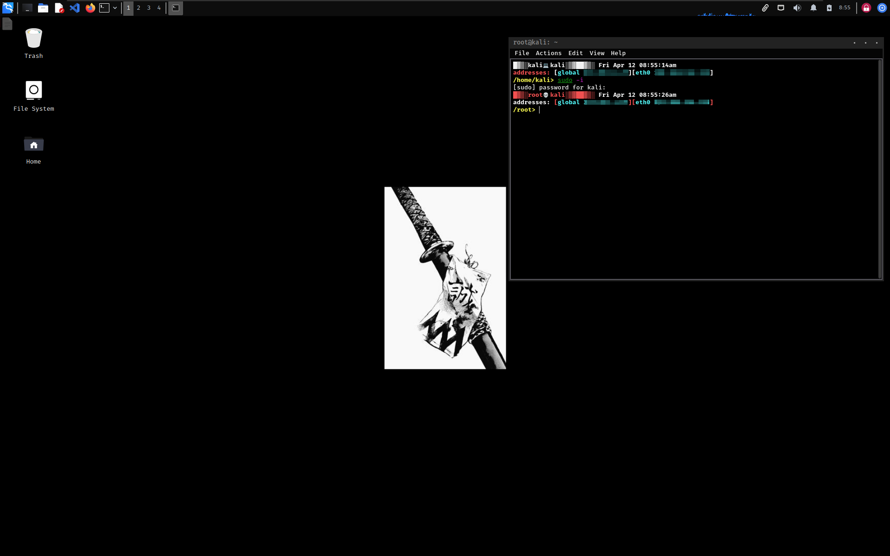

- [linux-reset](#linux-reset)
  - [Theme](#theme)
    - [Installation](#installation)

# linux-reset

This repository was made to customize my Kali Linux, install some important tools used for pentesting/ctf's.  

## Theme

The theme in use is [Mantissa](https://github.com/mantissa-/mantis-theme) and the icons in use are [Flat-Remix-Black Icons](https://www.gnome-look.org/p/1012430/).

### Installation

- We open up `Appearance` and add the Mantissa.zip theme and the Flat-Remix icons. We change the font to `Fira Code Medium` with font size 10.
- Open up `Window Manager` and change the style to Mantissa.
- Copy the contents in `files/home/config` into `~/.config` and rewrite the old files
- Then copy `etc/profile` to `/etc/profile`
- And finally copy `files/home/zshrc` to `~/.zshrc`

After installing the themes and the configs Kali should have a darker look.